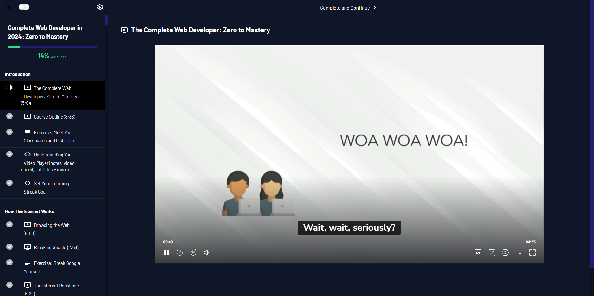
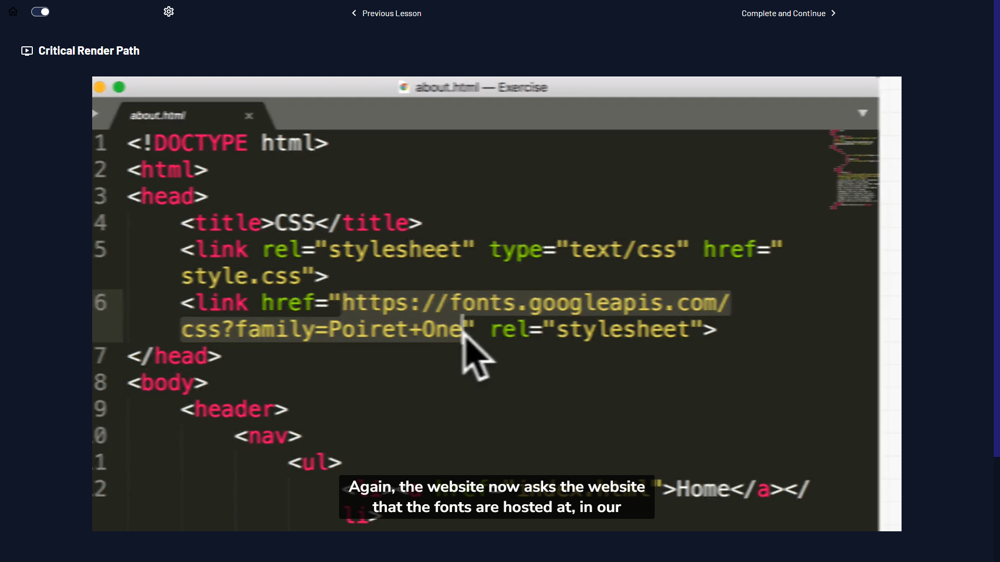

# Zero To Mastery - Extension

Fork of the Official extension for Zero To Mastery Academy students. [2023-12-15]

Personal touches for dark mode mainly; No promises made the changes will work as well on your machine.

See the official here: <https://github.com/sithu-khant/ztm-extension>

Main changes: 

* Theme is blueified instead.
* Removes borders (True in both dark and light mode)
* Darkify scrollbars as well
* Slightly reduced scrollbars widths

- Vidsize version made specifically for me, reduces video player to about 80% its max size so it fits nicely in my browser; not the best method however, it's not all that responsive. May change or further on...

=== Changes made only for the Chrome Extension ===

## Screenshot Example:

## Download & Installing it

May only be installed locally on Chrome for now. 

* Follow the guide made by Sithu himself here: [Installing extension on Google Chrome locally](./docs/install-on-chrome.md)

## License

MIT License

## Logs

I make no promises to keep this updated. :flushed:

* Fri Dec 15, 2023 - My Fork, theme updates.
* Thu Dec 14, 2023 - fixed all the `<a>` tags that are not underlined in dark mode. Fixed a lot of bugs. Released version (2023.12.14.01).
* Wed Dec 13, 2023 - Version (23.12.13) pre-release and version (2023.12.13)
* Tue Dec 12, 2023 - Launched first version (2023.12.12).
* Sun Dec 10, 2023 - Started the project.
